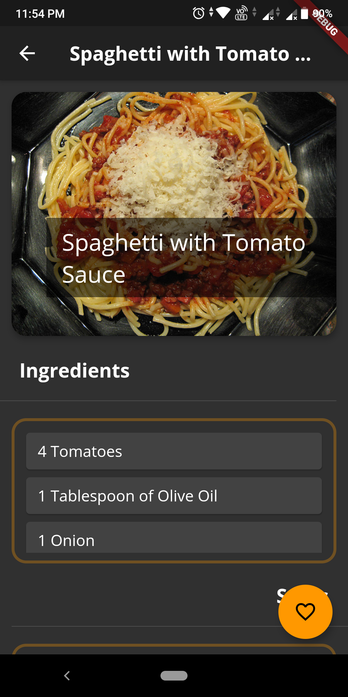

# Meals_app [DeliMeals]

A simple recipe app with dark mode made with flutter for viewing recipes of various meals. You can also filter the meals and add them to favorites.

## Screenshots

&nbsp;   &nbsp;   &nbsp;     &nbsp;   &nbsp;      &nbsp;   &nbsp;      &nbsp;   &nbsp;      &nbsp;   &nbsp;   

## Getting Started

This project is a starting point for a Flutter application.

A few resources to get you started if this is your first Flutter project:

- [Lab: Write your first Flutter app](https://flutter.dev/docs/get-started/codelab)
- [Cookbook: Useful Flutter samples](https://flutter.dev/docs/cookbook)

For help getting started with Flutter, view our
[online documentation](https://flutter.dev/docs), which offers tutorials,
samples, guidance on mobile development, and a full API reference.
